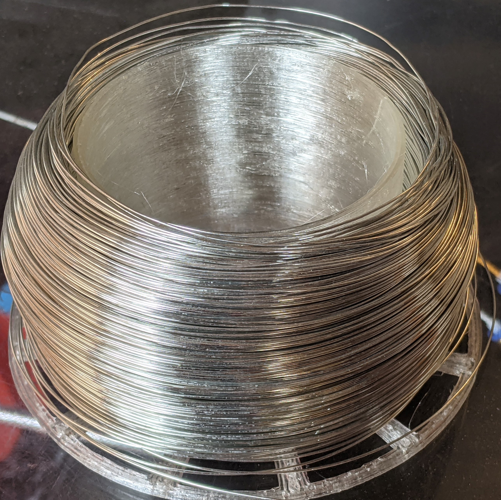
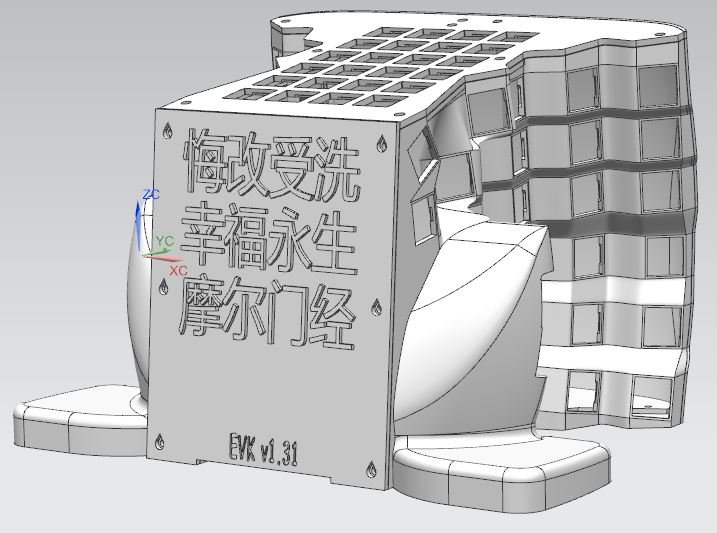
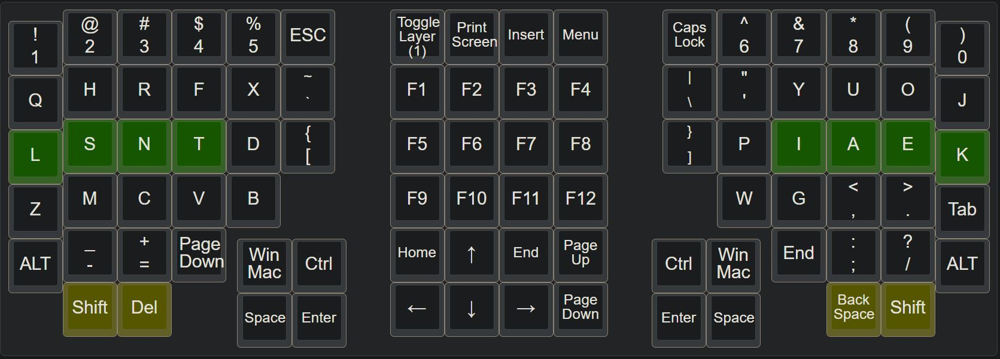

# 0. Part List  
* 1x Teensy 2.0 USB Board. （开发板）  

* 90 Cherry Mechanical Switch. （樱桃轴）

* 90 1N4148 diode.（开关二极管）One diode for each key switch.
* 2x 3mm T1 LEDs. （发光二极管）  
* 2x 1kΩ resistors to connect in series with the LEDs.（电阻）

* 0.6mm (wire diameter) tin-coated naked wire.

* 20cm long, 0.6mm (core diameter) sillicon wrapped wire. Get these pre-soldered ones to save time.

* 24 M3x6mm flat tip self-tap screws.

* 10 8mm diameter x 3mm tall silicon dome sticker feet.

* Soldering Iron and Hot Glue Gun.

# [1. Case](Case) 

# 2. Keymap 
I manually designed a keymap based on English [letter](https://norvig.com/mayzner.html) and [character](http://xahlee.info/comp/computer_language_char_distribution.html) frequencies.  
[Access this keymap on the Keyboard Layout Editor](http://www.keyboard-layout-editor.com/#/gists/22fd1367d74f0ee4a891c60fcb62eb59)  
  
[It fares OK against other traidtional layouts according to the Keyboard Layout Analyzer.](http://patorjk.com/keyboard-layout-analyzer/#/load/hqrGn4NG)

# [3. Electronics, Firmware and Software](ElectronicsFirmwareAndSoftware)

###### [ODC Open Database License v1.0](https://choosealicense.com/appendix/)  (free but no patent or commercial use)
