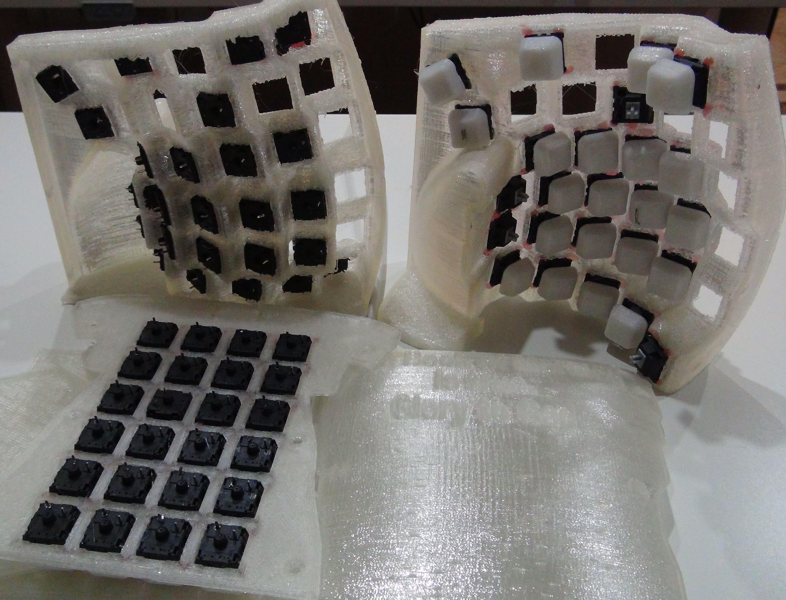

# Keyboard Case
Please visit [v1.2](https://github.com/YangPiCui/ErgonomicVerticalKeyboard/tree/master/EVK_v1.2/Case#siemens-nx-modelling) for how the keyboard is designed.  

## 0. 3D Printing the Components
"./STLFiles/" constains the .stl files of the various parts. Modelling uncertainty for part clearance = +/-0.25mm (tolerance 0.5mm)  
Before 3D printing the parts, make sure to fully calibrate your printer. [This is how I did it.](https://github.com/YangPiCui/3DPrinterCalibrationAndTuning/tree/master/DoogellVegaWithPLA)  
"./CuraSettings/" contains my Cura print settings  
  
### 0. Keycaps
Layer Height = 0.16mm (See Cura settings in "./CuraSettings/Vega PLA ND=0.3 LH=0.16.curaprofile")  
I have designed the keycaps for a press-fit on the Cherry Switches, but you may have to fine tune your own print settings to achieve this result. Once you have fully calibrated your printer, play with the Horizontal Expansion setting in Cura. 

KeycapHome x 12 (8 for the home row and 4 for the most bottom row)  
KeycapThumb x 4  
KeycapNormal x 74  
  
Print the keycaps in this orientation for a smooth finish:  
  

### 1. Other parts
Layer Height = 0.24mm (See the settings in "./CuraSettings/Vega PLA ND=0.3 LH=0.24.curaprofile")  
  
LeftHandPlate x 1  
RightHandPlate x 1 (just mirror the LeftHandPlate.stl in Cura)  
TopWall x 1  
... x 1  

Print these parts in this orientation to minimize support:

## 1. Pre-assemble the Components
Be patient in removing the print supports.  
Hot-glue Cherry Switches onto the plates:  
  

###### [ODC Open Database License v1.0](https://choosealicense.com/appendix/)  (free but no patent or commercial use)