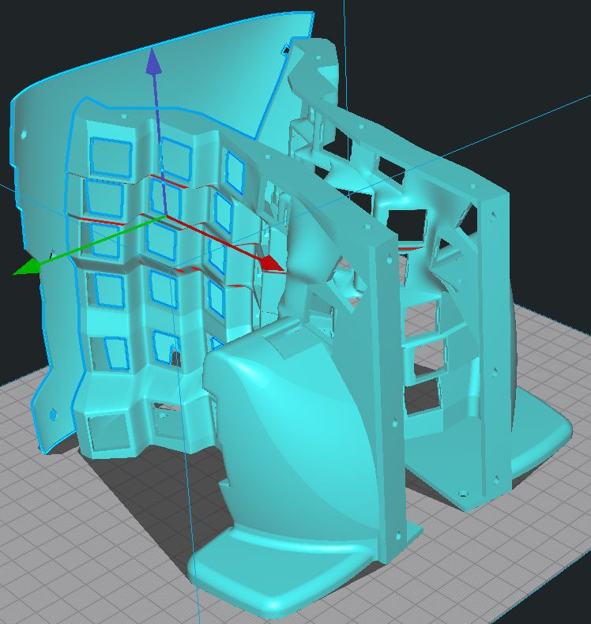

# Keyboard Case
Please visit [v1.2](https://github.com/YangPiCui/ErgonomicVerticalKeyboard/tree/master/EVK_v1.2/Case#siemens-nx-modelling) for how the case is designed.  

## 0. 3D Printing the Components
"./STLFiles/" constains the .stl files of the various parts. Modelling uncertainty for part clearance = +/-0.25mm (tolerance 0.5mm)  
Before 3D printing the parts, make sure to fully calibrate your printer. [This is how I did it.](https://github.com/YangPiCui/3DPrinterCalibrationAndTuning/tree/master/DoogellVegaWithPLA)  
"./CuraSettings/" contains my Cura print settings  
  
### 0. Keycaps
Print the keycaps in this orientation for a smooth finish:  
  
Layer Height = 0.16mm  
Brim & Support Brim = off (turn brims off so that they don't stick to the keycaps)  
See Cura settings in "./CuraSettings/Vega PLA ND=0.3 LH=0.16.curaprofile"   
I have designed the keycaps for a press-fit on the Cherry Switches, but you may have to calibrate your own printer to achieve this result.  

KeycapHome x 12 (8 for the home row and 4 for the most bottom row)  
KeycapThumb x 4  
KeycapNormal x 74  
  

### 1. Other parts
There will be much support structure. Be patient in removing it.  
Print these parts in this orientation to minimize support:
  
Layer Height = 0.24mm (See the settings in "./CuraSettings/Vega PLA ND=0.3 LH=0.24.curaprofile")  
  
LeftHandPlate x 1  
RightHandPlate x 1 (just mirror the LeftHandPlate.stl in Cura)  
TopWall x 1  
... x 1  

## 1. Assembly
### 0. Hot-glue Cherry Key Switches
I put some hot glue on the four corners of each keyswitch to secure it on the plates. 
  
### 1. Press-fit Keycaps
First use a soldering iron and a knife to smooth and trim the edges of the printed keycaps. Then press-fit the keycaps onto the keyswitches.

###### [ODC Open Database License v1.0](https://choosealicense.com/appendix/)  (free but no patent or commercial use)