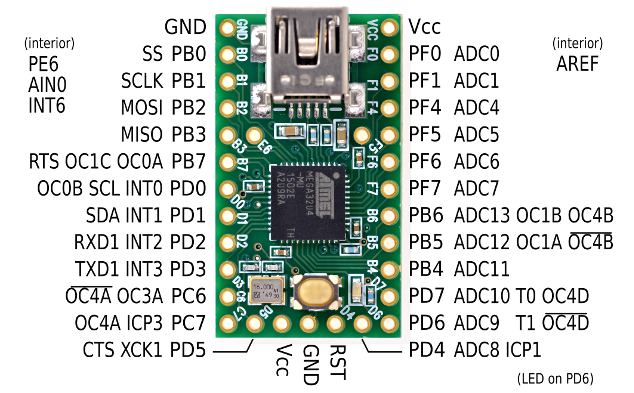

# ElectronicsFirmwareAndSoftware

## 0. Code the QMK Firmware for EVK
### 1.0 [Setup the QMK build environment](https://docs.qmk.fm/#/newbs_getting_started)  
During Windows setup, follow [this](https://stackoverflow.com/questions/41932407/which-python-should-i-install-and-how-when-using-msys2) and [this](https://stackoverflow.com/questions/48087004/installing-pip-on-msys) to install Python3 and pip on MSYS2.  
Open up C:\MSYS64\home\(username)\qmk_utils\activate_msys2.sh, and add cd ~/qmk_firmware, or whatever the path is. That way, when you open up MSYS, it will automatically start in the qmk directory.

### 1.1 Fork https://github.com/qmk/qmk_firmware on Github
[Step-by-step guide to contributing on GitHub](https://www.dataschool.io/how-to-contribute-on-github/)  
[Keep the forked repository and the local copy up-to-date](https://www.earthdatascience.org/courses/intro-to-earth-data-science/git-github/github-collaboration/update-github-repositories-with-changes-by-others/)   
Local QMK Repository Path: C:\Users\<UserName>\qmk_firmware  

### 1.2 Write Custom Codes
[Understand the keyboard matrix](https://www.dribin.org/dave/keyboard/one_html/)   
[Rollover, blocking and ghosting](https://deskthority.net/wiki/Rollover,_blocking_and_ghosting)   
[Understanding QMK’s Code](https://docs.qmk.fm/#/understanding_qmk?id=matrix-to-physical-layout-map)   
  
Copy /keyboards/handwired/dactyl_left into /keyboards/handwired/evk and modify the files according to [these guidelines](https://docs.qmk.fm/#/hardware_keyboard_guidelines?id=custom-keyboard-programming).  
  
#### 1.2.0 "/handwired/evk/"
* readme.md - update   
* info.json - update 

#### 1.2.1 "/handwired/evk/v1_3/"    
* readme.md - update   
* rules.mk - no change  
* config.h  
  * change matrix size to 6(rows) x 16(cols) 
  * define the matrix row and col pins for the [Teensy 2.0](https://www.pjrc.com/teensy/pinout.html)
  * #define DIODE_DIRECTION ROW2COL // the current flows into the rows and then out of the columns  
  * [define status LEDs](https://docs.qmk.fm/#/feature_led_indicators?id=configuration-options)
```c
#define MATRIX_ROWS 6
#define MATRIX_COLS 16
#define MATRIX_ROW_PINS \
    { B0, B1, B2, B3, B7, D0 }
#define MATRIX_COL_PINS \
    { D1, D2, D3, C6, C7, F0, F1, F4, F5, F6, F7, B6, B5, B4, D7, D6 }
#define DIODE_DIRECTION ROW2COL
#define LED_CAPS_LOCK_PIN D4  //This same pin is used in v1_3.c to switch the LED on/off
```  


* v1_3.c
  * Add the codes to control status LEDs ([Layer Change Code](https://docs.qmk.fm/#/custom_quantum_functions?id=layer-change-code))
```c
void matrix_init_kb(void) {
    // Set the LEDs pins
    setPinOutput(D5); // Layer 1 Status LED

    matrix_init_user();
}

__attribute__((weak)) layer_state_t layer_state_set_user(layer_state_t state) {
    writePin(D5, layer_state_cmd(state, 1));
    return state;
}

bool led_update_kb(led_t led_state) {
    bool res = led_update_user(led_state);
    if (res) {
        // writePin sets the pin high for 1 and low for 0.
        writePin(D4, led_state.caps_lock);
    }
    return res;
}
```

* v1_3_h    
  * map the matrix to physical layout ([How the Configurator Understands Keyboards](https://docs.qmk.fm/#/reference_configurator_support?id=how-the-configurator-understands-keyboards) | [the keymap variables can be whatever as long as they are unique](https://www.reddit.com/r/olkb/comments/42ohxz/crazy_columns_and_tons_of_keys_with_qmk/?utm_source=amp&utm_medium=&utm_content=post_body))
```c
#define LAYOUT(\
      k0A, k0B, k0C, k0D, k0E, k0F,    k0G, k0H, k0I, k0J,    k0K, k0L, k0M, k0N, k0O, k0P, \
      k1A, k1B, k1C, k1D, k1E, k1F,    k1G, k1H, k1I, k1J,    k1K, k1L, k1M, k1N, k1O, k1P, \
      k2A, k2B, k2C, k2D, k2E, k2F,    k2G, k2H, k2I, k2J,    k2K, k2L, k2M, k2N, k2O, k2P, \
      k3A, k3B, k3C, k3D, k3E,         k3G, k3H, k3I, k3J,         k3L, k3M, k3N, k3O, k3P, \
      k4A, k4B, k4C, k4D, k4E,  k4F,   k4G, k4H, k4I, k4J,   k4K,  k4L, k4M, k4N, k4O, k4P, \
           k5B, k5C,       k5E, k5F,   k5G, k5H, k5I, k5J,   k5k, k5L,       k5N, k5O       \
) { \
    { k0A, k0B, k0C, k0D, k0E, k0F,    k0G, k0H, k0I, k0J,    k0K, k0L, k0M, k0N, k0O, k0P }, \
    { k1A, k1B, k1C, k1D, k1E, k1F,    k1G, k1H, k1I, k1J,    k1K, k1L, k1M, k1N, k1O, k1P }, \
    { k2A, k2B, k2C, k2D, k2E, k2F,    k2G, k2H, k2I, k2J,    k2K, k2L, k2M, k2N, k2O, k2P }, \
    { k3A, k3B, k3C, k3D, k3E,  XXX,   k3G, k3H, k3I, k3J,   XXX,  k3L, k3M, k3N, k3O, k3P }, \
    { k4A, k4B, k4C, k4D, k4E,  k4F,   k4G, k4H, k4I, k4J,   k4K,  k4L, k4M, k4N, k4O, k4P }, \
    { XXX, k5B, k5C, XXX,  k5E, k5F,   k5G, k5H, k5I, k5J,   k5k, k5L,  XXX, k5N, k5O, XXX }  \
}
```

* info.json ([Supporting Your Keyboard in QMK Configurator](https://docs.qmk.fm/#/reference_configurator_support))
  * build the [keymap](../Keymap) in the Keyboard Layout Editor
  * convert its raw data into .json format with the [QMK KLE-JSON Converter](https://qmk.fm/converter/) 
  * override the existing contents of info.json with the converted contents 
  * in [QMK Configurator](https://config.qmk.fm/), press Ctrl+Shift+I to upload the new info.json file and check if it's correct.
```
{
    "width": 22.75,
    "height": 7.5,
    "layouts": {
        "LAYOUT": {
            "layout": [
                {"label":"k0A", "x":0, "y":0.5, "w":1.25, "h":1.25},
                {"label":"k0B", "x":1.25, "y":0.25, "w":1.25, "h":1.25},
                {"label":"k0C", "x":2.5, "y":0, "w":1.25, "h":1.25},
                ...
                {"label":"k5N", "x":19, "y":6.25, "w":1.25, "h":1.25},
                {"label":"k5O", "x":20.25, "y":6.5, "w":1.25, "h":1.25}
            ]
        }
    }
}
```

#### 1.2.2 "/handwired/evk/1_3/keymaps/default"
* readme.md - update
* config.h - no change
* keymap.c 
  * look up the [default keycodes](https://docs.qmk.fm/#/faq_keymap?id=what-are-the-default-keycodes) and [customize The Layout To Your Liking](https://docs.qmk.fm/#/newbs_building_firmware?id=customize-the-layout-to-your-liking).  

### 1.3 Compile the Firmware 
In MSYS2, type
```c
qmk compile -kb handwired/evk/v1_3 -km default
```
The generated .hex file is located at /qmk_firmware/.build/handwired_evk_v1_3_default.hex on the local computer.   
If giving "Error: C:/Users/<UserName>/qmk_firmware is too old or not set up correctly!", run ["python3 -m pip install pygments"](https://github.com/qmk/qmk_firmware/issues/10602) and ["python3 -m pip install -U qmk"](https://github.com/qmk/qmk_firmware/issues/10602) in MSYS2.  
  
  
## 1. [Alternatively] Compile the Firmware in the QMK Corfigurator 
Open the [QMK Configurator](https://config.qmk.fm/#/handwired/evk/v1_3/LAYOUT), follow the [QMK Configurator Guide](https://docs.qmk.fm/#/newbs_building_firmware_configurator), load /handwired/evk/v1_3, modify the keymap to your liking, compile, and generate the .hex file for section 2.


## 2. Flash Firmware Onto the Micro-controller
Use the [Teensy Loader](https://www.pjrc.com/teensy/loader_win10.html) to flash the .hex file onto the Teensy 2.0.

    
## 3. Wire up the Keyboard Matrix  
Rows and columns on the physical keyboard:  
  
Note in config.h #define DIODE_DIRECTION ROW2COL. Current flows from the Teensy pins into the rows and out of the columns to the ground.

### 0. Rows  
I used a naked wire to connect the switches on each row together. I used hot glue for insulation against diodes.
 

### 1. Columns
The diodes need the black bar facing away from the key.  
For the right hand part:  
 

Both parts:  
 


## 4. Wire up the Micro Controller
  
 
 

See [Section 1.2.1](https://github.com/YangPiCui/ErgonomicVerticalKeyboard/tree/master/EVK_v1.3/ElectronicsFirmwareAndSoftware#121-handwiredevkv1_3) for the Teensy pins.  
Note that pin D5 on the Teensy is used for the layer switch indicator LED.  


  

###### [ODC Open Database License v1.0](https://choosealicense.com/appendix/)  (free but no patent or commercial use)