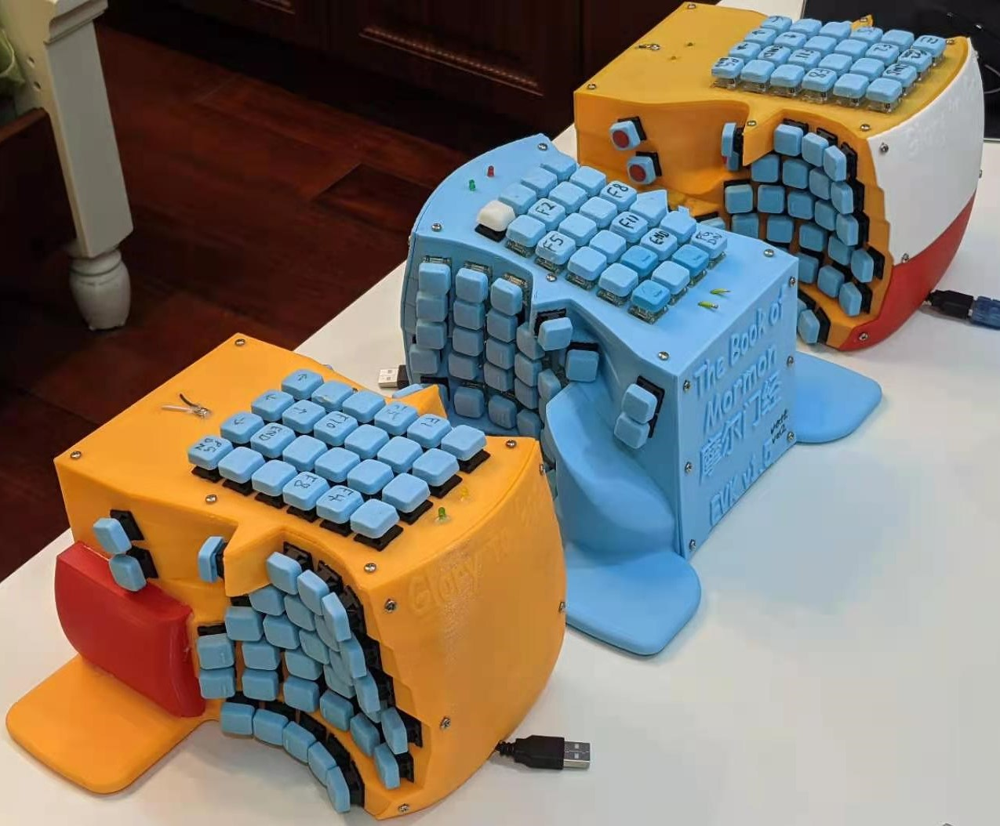
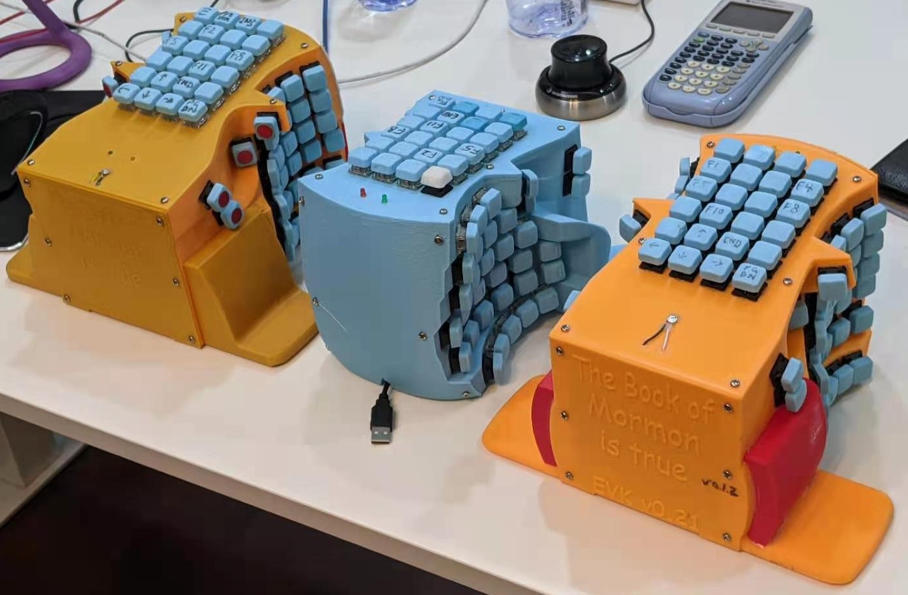

# Ergonomic Computer Keyboard (ECK)

## switching to FreeCAD and (extremely) slowly working on the next iteration
## let me know if you want to draw the case

## Introduction
Flat keyboard and mouse force our hands to pronate. This posture makes our fingers stiffened, neck sore, and back humped, harming our health in the long run.  
The Ergonomic Computer Keyboard (ECK) combines many existing ergonomic features for the typists. Instead of a hefty price tag, it is completely free for DIY.  
- Tilted keys. [[SafeType](https://safetype.com/index.php?id_product=1&controller=product) | [ergodox ez vertical stand](https://www.thingiverse.com/thing:2748084)&nbsp;| [Ergodox EZ tent kit](https://www.thingiverse.com/thing:1433117) | [A Similiar Project](https://thomasbaart.nl/2019/01/20/vertikeeb-making-a-vertical-keyboard-part-1/)]
- Concave keywell. [[Kinesis Advantage 2](https://kinesis-ergo.com/shop/advantage2/)  | [British patent 1,016,993](https://geekhack.org/index.php?topic=63415)]  
- Fewer pinkie keys.  
- Better (customizable) keymap than qwerty, dvorak, coleman, etc.  
- Hot swappable keys.  
- Low latency response for gamers.  

  
  
[EVK_v0.1.2](Versions/EVK_v0.1.2)  

## [Versions <- click](Versions)  
It takes one about one week to build an ECK from scratch.  

## [Keymap Optimization](KeymapOptimization) (Under Development)

## External Resources
[Main Reddit Thread](https://www.reddit.com/r/ErgoMechKeyboards/comments/g28c2i/ergonomicverticalkeyboard_thread/) | [Old](https://www.reddit.com/r/ErgoMechKeyboards/comments/fvxuw1/need_help_combining_all_of_the_good_features_from/) | [Older](https://www.reddit.com/r/MechanicalKeyboards/comments/fumlvb/possible_to_absorb_and_combine_all_of_the_good/)  

[reddit.com/r/MechanicalKeyboards/](http://reddit.com/r/MechanicalKeyboards/)&nbsp;|&nbsp;[https://www.reddit.com/r/ErgoMechKeyboards/](https://www.reddit.com/r/ErgoMechKeyboards/)  
[https://geekhack.org/](https://geekhack.org/)  
[Xah Keyboard Guide](http://Xah%20Keyboard%20Guide)  
[Reddit Post 0](https://www.reddit.com/r/MechanicalKeyboards/comments/fumlvb/possible_to_absorb_and_combine_all_of_the_good/) | [Reddit Post 1](https://www.reddit.com/r/ErgoMechKeyboards/comments/fvxuw1/need_help_combining_all_of_the_good_features_from/) | [Main Reddit Thread ](https://www.reddit.com/r/ErgoMechKeyboards/comments/g28c2i/ergonomicverticalkeyboard_thread/)  

[Ergodox](https://www.ergodox.io/)  
[Dactyl Keyboard Wiring](https://github.com/adereth/dactyl-keyboard/blob/master/guide/README.org#wiring)   
[Ergo-Dox keyboard assembly](https://www.youtube.com/watch?v=x1irVrAl3Ts)  
[Keyboard PCB Guide](https://github.com/ruiqimao/keyboard-pcb-guide)   
[GMK Carbon Original Ergodox build log](https://imgur.com/a/3riAB)  
[Dactyl Manuform Mini DIY Ergonomic Mechanical Keyboard Build Log](https://www.beekeeb.com/dactyl-manuform-mini-mechanical-keyboard-build-log/)   
[Detailed guide to making a custom keyboard](https://www.reddit.com/r/MechanicalKeyboards/comments/4l0p41/guide_detailed_guide_to_making_a_custom_keyboard/?utm_source=amp&utm_medium=&utm_content=post_body)  
[Building your own keyboard (from scratch)](https://medium.com/@monkeytypewritr/building-your-own-keyboard-from-scratch-bd0638c40850)  

[Windows 10 Key Mapping software](https://thegeekpage.com/top-10-best-free-key-mapping-software-for-windows-10/)&nbsp;| [SharpKeys](https://github.com/randyrants/sharpkeys/releases)

## [How to Donate](https://github.com/YangPiCui/ProjectIdeas/blob/main/README.md#how-to-donate-in-descending-preference-for-me)

###### [ODC Open Database License v1.0](https://choosealicense.com/appendix/)  (free but no patent or commercial use)
