# Features
1. parametric so that other people can contribute adjust tolerances to fit their 3D printer (especially the switch holes)  
2. the whole keyboard is a whole but it must be assembled in parts to minimize support structure for 3D printing  
3. hard xot soft PCB
4. have you made custom desktop app to change keyboard's character assignments?   
5. keep the manufacturing cost as low as possible (if everything fits on a Teensy 2.0 then great)  
6. need to keep the latency down for gamers  
7. the keyboard should resemble the Kinesis Advantage 2 but tilted more and with more keys.  
8. no colume outside of the little fingers. so need to move those keys to the middle for the index fingers.  
9. hot swappable keys  

# Part List  

# [Case](Case) 

# Keymap 
[Layer0](http://www.keyboard-layout-editor.com/#/gists/2fc38dca845ec5f253bac7c052df82da)  
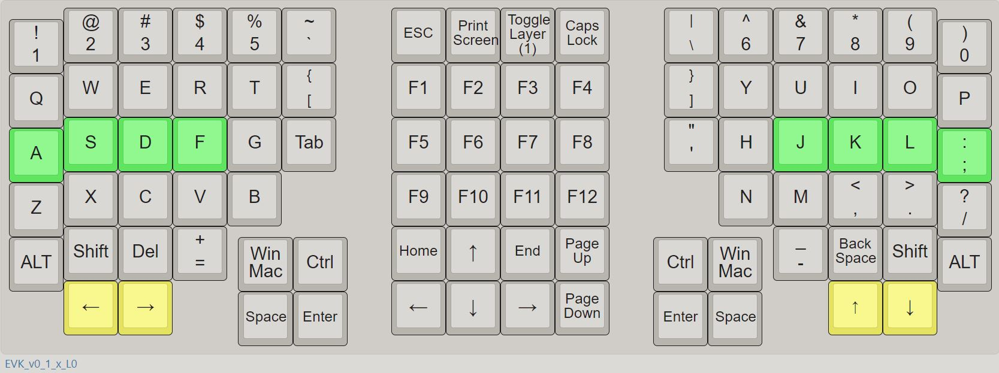  
[Layer1](http://www.keyboard-layout-editor.com/#/gists/1d35c2bdc8fc2de6860daa4e2ee97f45)  
I manually designed a keymap based on English [letter](https://norvig.com/mayzner.html) and [character](http://xahlee.info/comp/computer_language_char_distribution.html) frequencies. [It fares well against other traidtional layouts according to the Keyboard Layout Analyzer.](http://patorjk.com/keyboard-layout-analyzer/#/load/hqrGn4NG)  
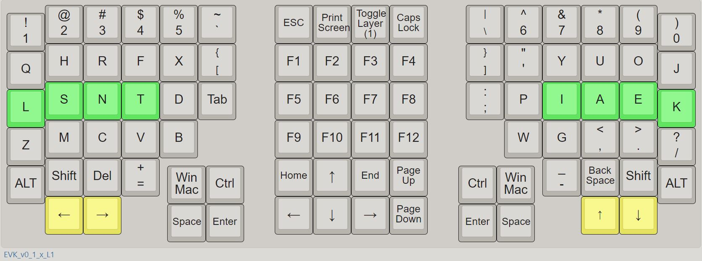  

# [Electronics, Firmware and Software](ElectronicsFirmwareSoftware)

# 3D Print 
"./3DPrintFiles/"  
"./CuraSlicerSettings/" 
The parts are of high precision. The fits are transitional clearance. [Calibrate](https://github.com/YangPiCui/3DPrinterCalibrationAndTuning/) your 3D printer accurately and follow the instructions closely. 

### Left Right and Front  
* Nozzle Diameter 0.3mm
* Layer Height 0.24mm
* Line Width 0.54mm
* Support Line Width 0.24mm for easy support removal   
* Tree Support Top Distance is 0.48mm, or twice the layer height. IMPORTANT. Do NOT set this value greater than what I have specified, otherwise the keyswitch might not fit. 
Print the Left Right and Front as if they would normally stand on the build plate. Set brim distance to 0mm for Front but not for Left or Right.  
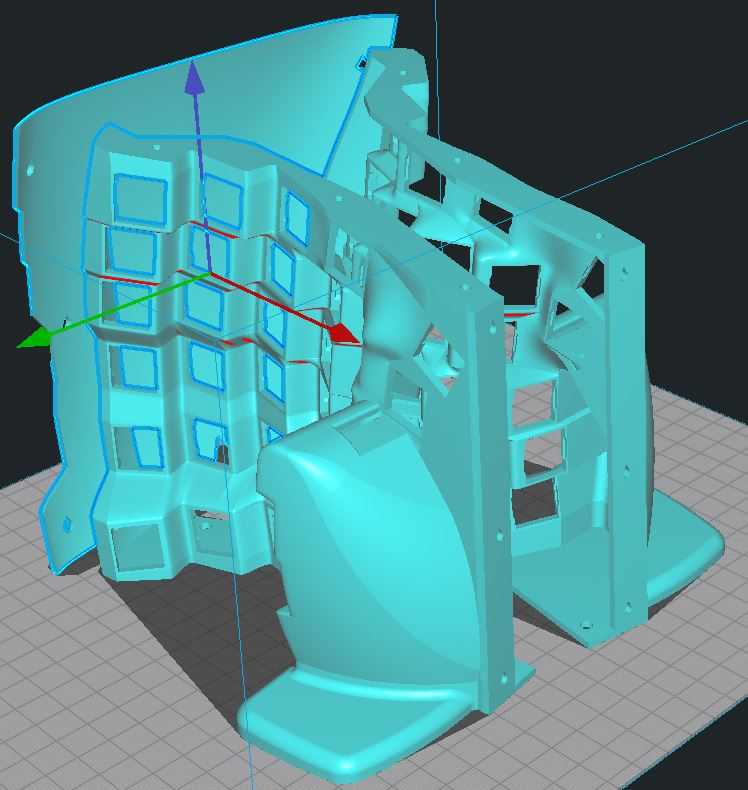  
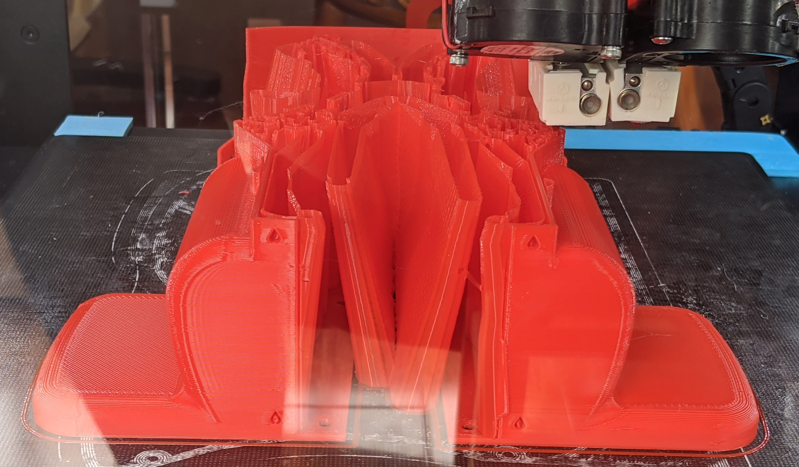  
  
### Top Bottom and Back
If switches do not fit on the Top Plate. Try adjusting the Horizontal Expansion in Cura. 
  
### Keycaps
The keycaps are a press-fit onto the Cherry Switches!  
* Nozzle Diameter 0.3mm
* Layer Height = 0.16mm 
* Support still needed in this version. No support necessary starting at v0.1.1. 
* Brim & Support Brim = off; They are painful to remove.  
Print the keycaps as if they would sit on the build plate.  
KeycapHome x 12 (8 for the home row and 4 for the most bottom row)   
KeycapThumb x 4   
KeycapNormal x 74   
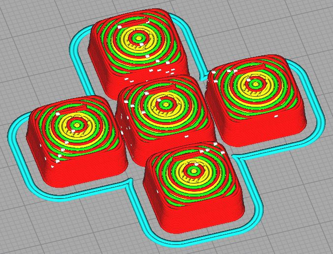    
Use a knife to trim the excess edges of the printed keycaps.
  
  
## Assembly

### Hot-glue Cherry Key Switches
Put some hot glue on the four corners of each keyswitch to secure it on the plates. Do it on the inside for a nicer outer finish.
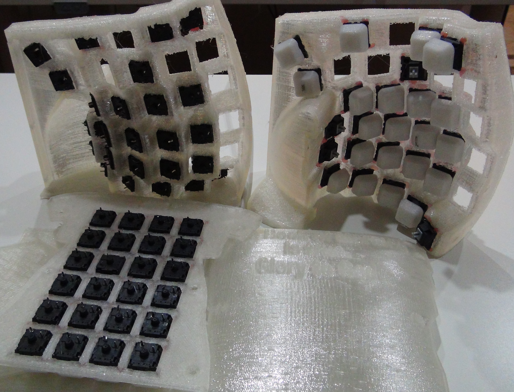  

### Wire up the Keyboard Matrix  
Rows and columns on the physical keyboard:  
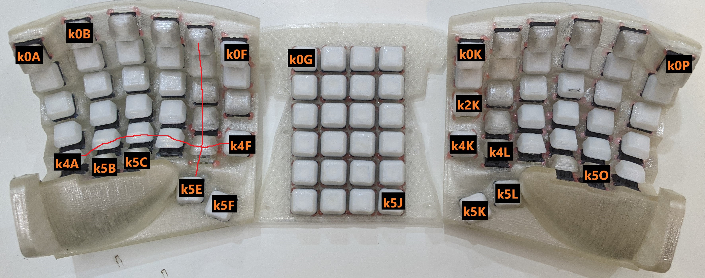  
Note #define DIODE_DIRECTION ROW2COL in config.h -- current flows from the positive Teensy pins into the matrix rows and out of the columns to the ground pin.  

### 0. Rows  
I used a naked wire to connect the switches on each row together. 
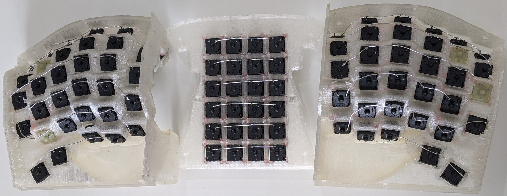 

### 1. Columns
First solder the diodes. The diodes need the black bar facing away from the key. The diode's black bar indicates its negative terminal.  
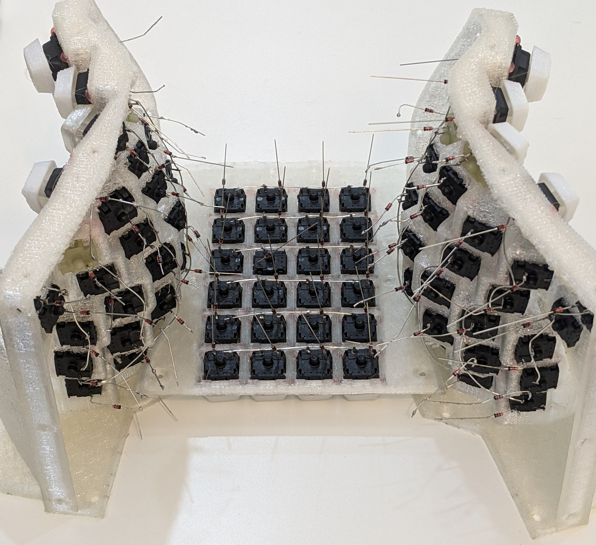  
  
Wire up the columns.  
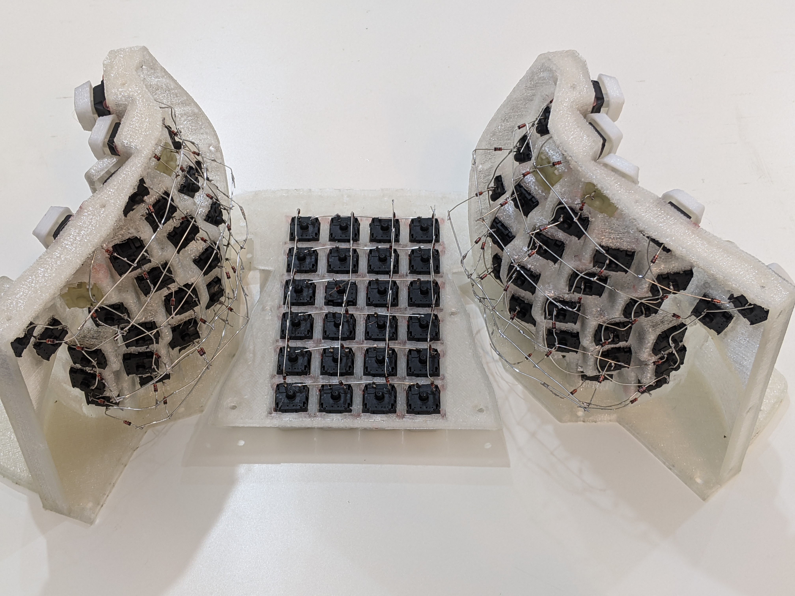  
  
Connect the rows.  
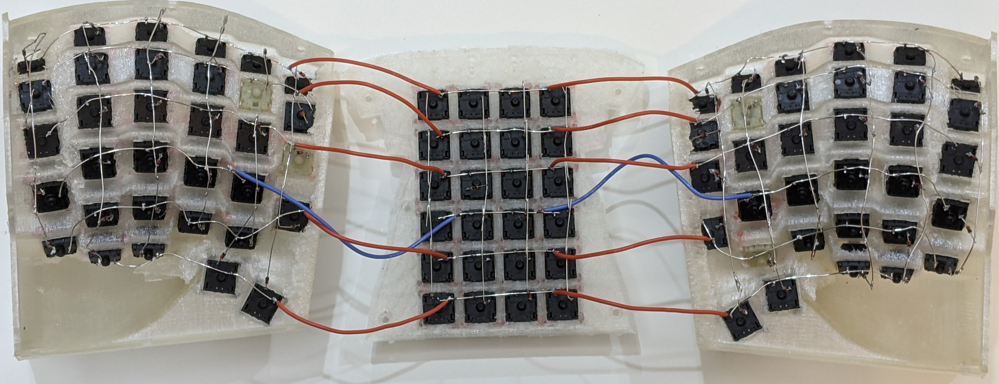  

### Wire up the Micro Controller
Refer to the [3. Electronics, Firmware and Software](ElectronicsFirmwareAndSoftware) section for Teensy pinouts.
Capslock LED on pin D4 and layer switch indictation on pin D5.    
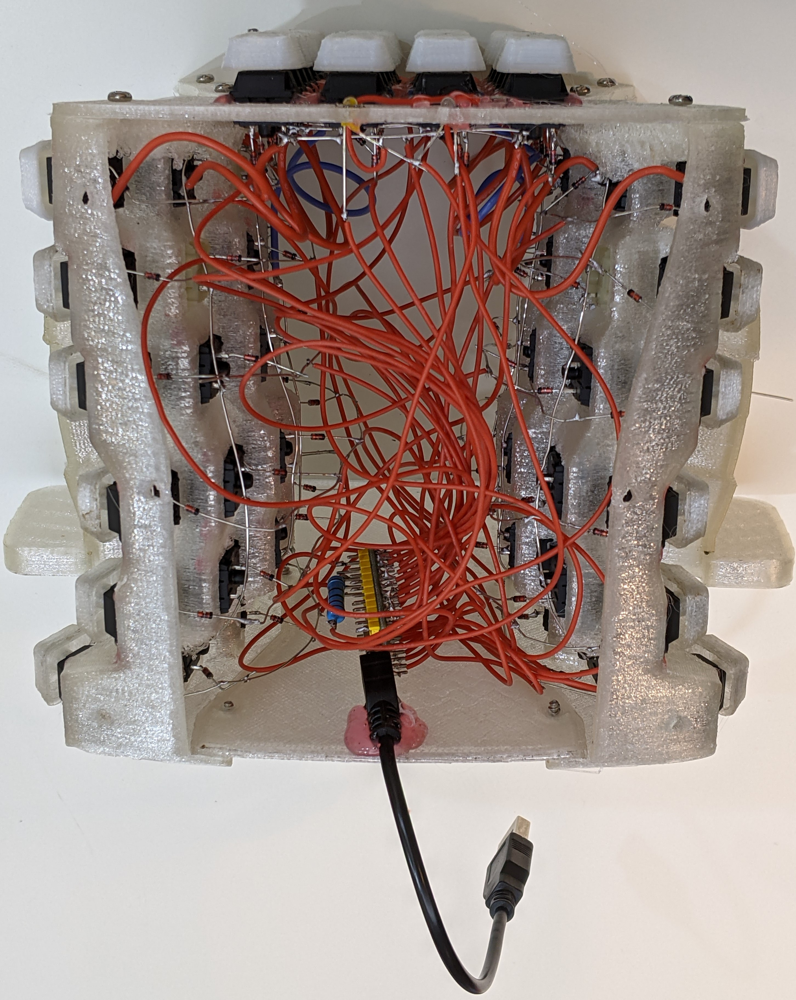  
  
LEDsAndResetButton  
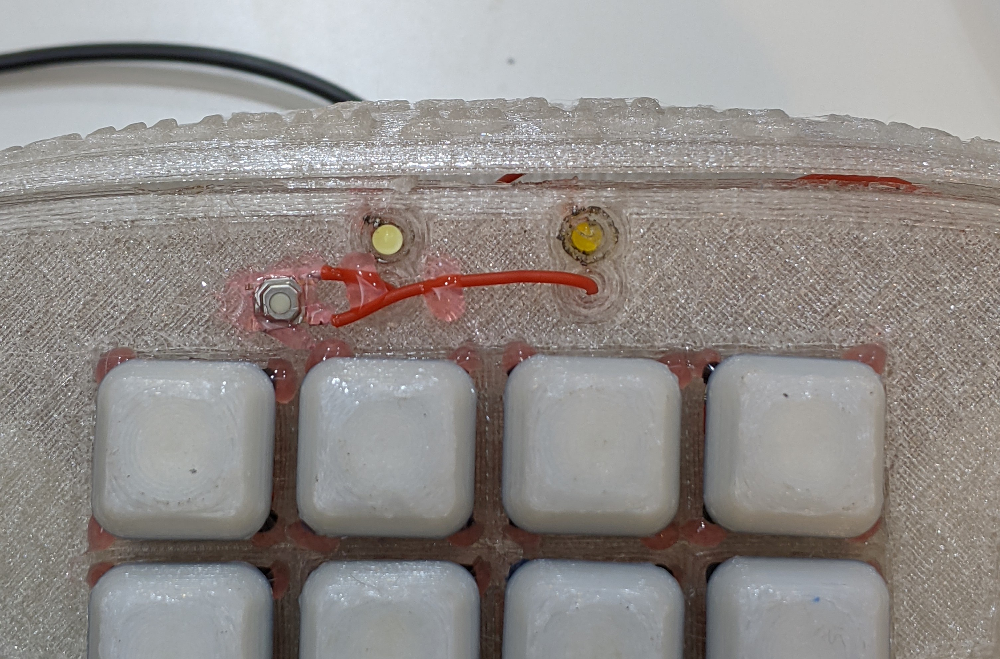  

### Put on the Sillicon Rubber Feet  
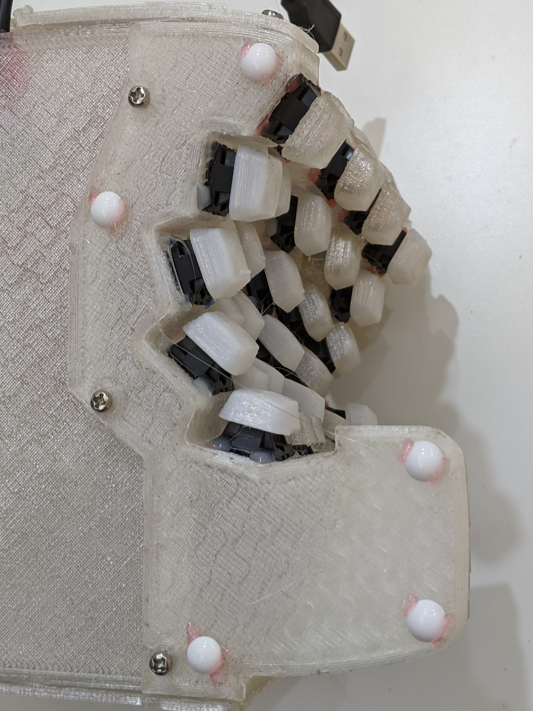  

### Smile
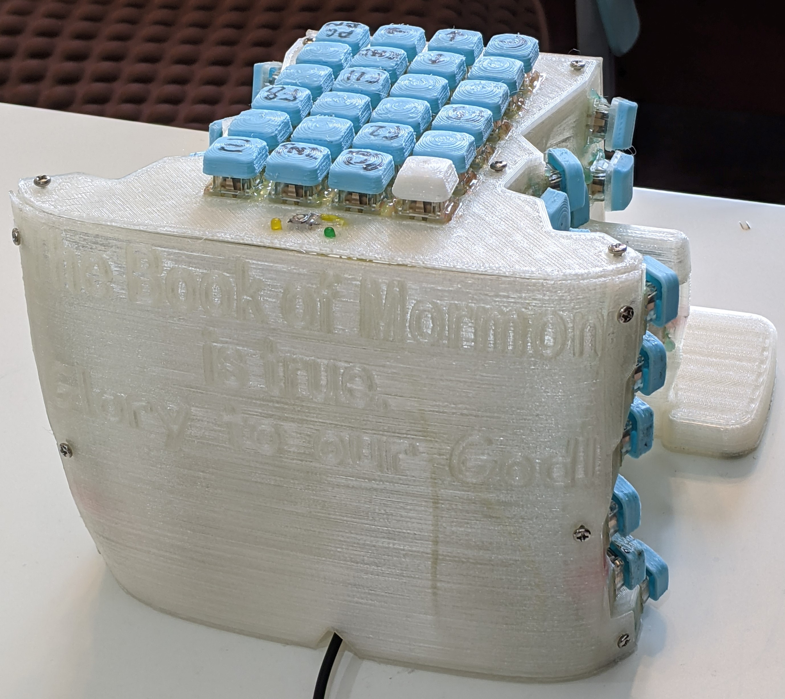
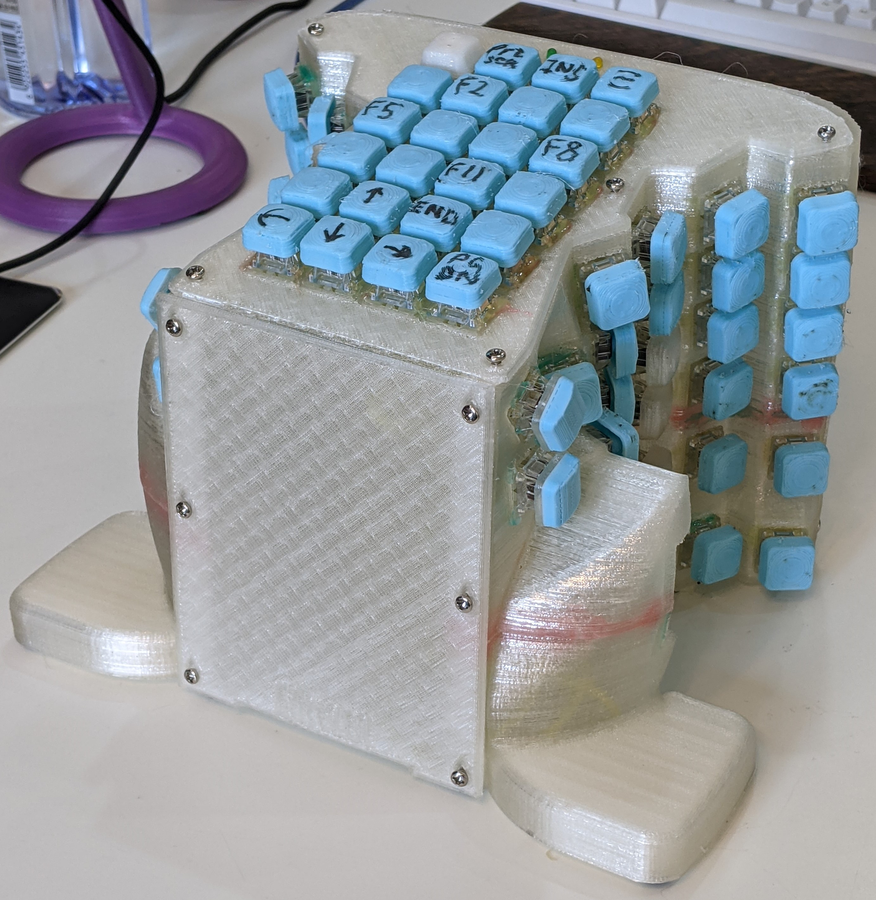

###### [ODC Open Database License v1.0](https://choosealicense.com/appendix/)  (free but no patent or commercial use)
